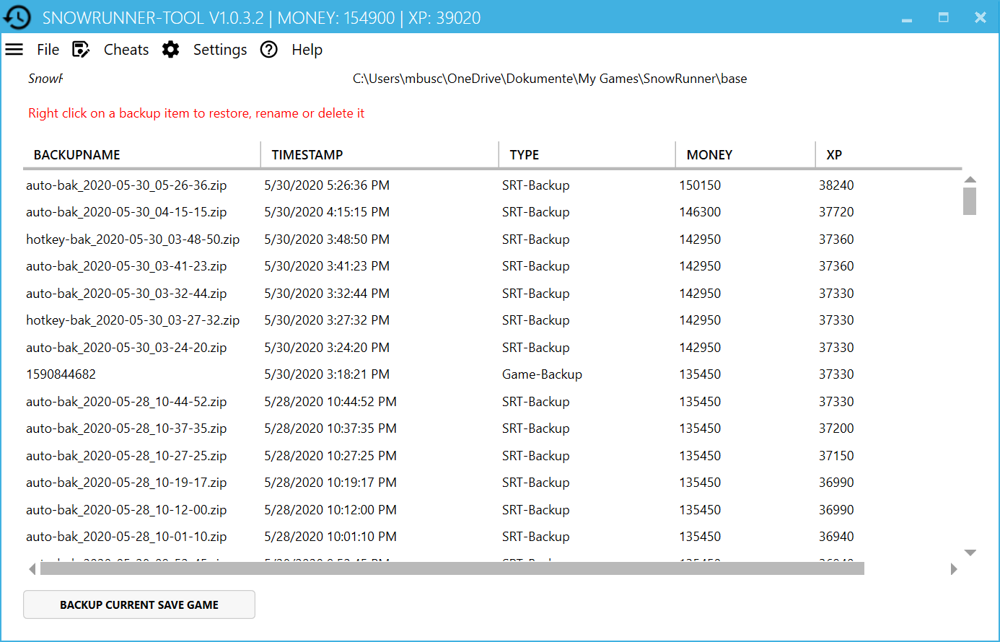
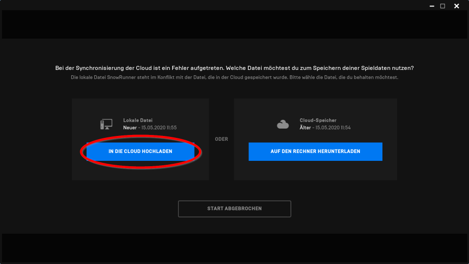

# SnowRunner-Tool

The game *SnowRunner* is a pain! Don´t play it. But if you do, you will sooner or later get stuck with your truck in the deepest mud, lose all your payload and your best trailer. That is the very moment, when this small tool comes into the game.

So, if you feel that restoring a saved game would sometimes be nice to have, here is the good news: The game creates backups from time to time, and it´s easy to restore them.

The *SnowRunner-Tool* does nothing that you could not do in a manual way, but it makes it safe and easy and it´s looking nice.

**Use this software with caution! I have tested a lot, but only on my own machine. I recommend to make manual backups until you are sure that everything works as expected.**

## Features

*SnowRunner-Tool* lets you
- create backups of the current game state and list them in a fancy style,
- create backups of the file `initial.pak` (which has to be changed for some mods),
- restore a saved game from the game´s backup repository, a backup made with this tool or a  former saved `initial.pak` file,
- cheat the amount of money you have in your pocket and
- cheat your experience points (XP).



## Installation

### Installation With Setup.exe

1. Download the latest `SRT_setup.zip` from [Github Releases](https://github.com/elpatron68/SnowRunner-Tool/releases) or [mod.io](https://snowrunner.mod.io/snowrunner-tool/#15370).
2. Unzip the file and install *SnowRunner-Tool*  by starting `SRT_setup.exe`. The setup will install the required Microsoft .NET Framework 4.7.2 if it is not found on your system.

### Manual Installation From Zip File

1. Microsoft .NET Framework 4.7.2. **must be installed** for *SnowRunner-Tool* to start! It should deliver with Windows Updates, but it is not a mandatory update. You can manually download .NET Framework 4.7.2 [here](http://go.microsoft.com/fwlink/?linkid=863262) or update your Windows - see optional updates.
2. Download the latest `SRT-portable.zip` from [Github Releases](https://github.com/elpatron68/SnowRunner-Tool/releases) and unzip the files to a location of your choice. **Never download the file from any other website**!
3. Start `SnowRunner-Tool.exe` or create a desktop shortcut. Windows will warn you about using suspicious software as this program is not signed with a valid certificate. You have to accept this at the first start.

## Uninstall

### Zip File Version

*SnowRunner-Tool* does not create any further files or registry settings. Just delete the folder you unzipped it to.

### Setup Version

Uninstall *SnowRunner-Tool* with the Windows *Programs and Functions* control.

## Usage

After the start, *SnowRunner-Tool* reads all backup files created by the game, by itself or by a third party backup script and lists them with their time stamps. Right click on a row to restore the selected backup. Before restoring anything, another backup of the current game state will be made.

### Save game backup

You can manually create a backup of the current game state by clicking on *Backup save game* in the *File* menu.

**Backups can be created while the game is running**. If you have to master a risky maneuver, just switch to your *SnowRunner-Tool* and make a backup before you fail.

### PAK backup

Create a backup of your `initial.pak` file before making changes to it! Open the *File* menu and select *Backup INITIAL.PAK*. The backup will be listed as *PAK-Backup* and can be restored as any other backup by right clicking on it.

**This feature is experimental, handle with care!**

### Cheats

Set the amount of money or experience points you´d like to have by opening the *Cheats* menu. Before changing the money in your save game file, another fresh backup will be created.


**See *Advanced* if you are asked for the path save game file after the first start.**

## Settings

In the *Settings* menu, you can save a couple paths this tool needs to operate. Also,  usage reporting and remote logging can en- and disabled. A check mark will be displayed if the option is enabled.

### Save Game Path

*SnowRunner-Tool* tries to find your save game path automagically at the first start (which is not always a trivial task). If this fails, the *Set save game path* dialog will open. If you like to change this setting at a later time, open the menu *Settings* -  *Set save game path*.


Click *Browse*, navigate to the file `CompleteSave.dat` and open it.

Usually, the file is located under your documents folder -> my games -> snowrunner -> base -> storage -> (profile directory, long name of random characters).

Example:
```
C:\Users\mbusc\Documents\My Games\SnowRunner\base\storage\f2555667235d4dbd899a5670674d88b0
```

All other path fields in the dialog are read only and will be filled by the app.

### Logging

Remote logging sends debug information to a private log server. Enable it if you have a problem with *SnowRunner-Tool*. If you need help from the developer, open an issue at [Github](https://github.com/elpatron68/SnowRunner-Tool/issues), describe the problem and post your Support ID (shown under *Help* - *Support ID*).

Usage reporting sends small datagrams whenever one of these events occur:

- User starts *SnowRunner-Tool* 
- User changes money or XP
- Critical errors

Both reporting options require an active internet connection. No personal data will be sent. Usage reporting helps the developer to decide, if this tool will be expanded in the future.

Debug logging is **disabled** by default. Usage reporting is **enabled** by default.

## Notes

* If *SnowRunner-Tool* does not start after double clicking, install Microsoft .NET Framework 4.7.2 (see *Installation* above).
* After restoring a save game from a backup or after altering the money, the *Epic Launcher* detects locally changed files. You are asked if you want to upload local files into the cloud or download cloud files to your local disk. Choose *Upload local files*.

## Advanced, Troubleshooting

### Save Game Path Not Found

If *SnowRunner-Tool* cannot find your game profile directory, you are asked to enter the path to your save game file *CompleteSave.dat*.


Select the file *CompleteSave.dat* in that folder, click *Open* and close the *FILE NOT FOUND!* dialog.

### Command line arguments

`-l`

Enables remote logging.

## Useful links

- User [grimdanfango](https://forums.focus-home.com/user/grimdanfango) made a Powershell Script that creates Backups in a configurable interval while the game is running. Instructions can be found <a href="https://forums.focus-home.com/topic/47932/backup-save-game-script" target="_blank">here</a>.
- Thread on <a href="https://www.reddit.com/r/snowrunner/comments/gdf1jt/pc_snowrunner_backs_up_your_saved_games_heres_how/" target="_blank">Reddit</a> discussing the games´s backups and how to restore them manually.
- This tool on [mod.io](https://snowrunner.mod.io/snowrunner-tool/#15370)

## License


```text
DO WHAT THE FUCK YOU WANT TO PUBLIC LICENSE 
Version 2, December 2004 

 Copyright (C) 2004 Sam Hocevar <sam@hocevar.net> 

 Everyone is permitted to copy and distribute verbatim or modified 
 copies of this license document, and changing it is allowed as long 
 as the name is changed. 

            DO WHAT THE FUCK YOU WANT TO PUBLIC LICENSE 
   TERMS AND CONDITIONS FOR COPYING, DISTRIBUTION AND MODIFICATION 

  0. You just DO WHAT THE FUCK YOU WANT TO.
 ```
 
 ## 3rd party Licenses
 
 - Icons from https://material.io/ ([Apache License](https://github.com/google/material-design-icons/blob/master/LICENSE))
 - WPF theme from https://mahapps.com/ ([MIT License](https://github.com/MahApps/MahApps.Metro/blob/develop/LICENSE))
 - [Command Line Parser Library for CLR and NetStandard](https://github.com/commandlineparser/commandline) (MIT License)
 